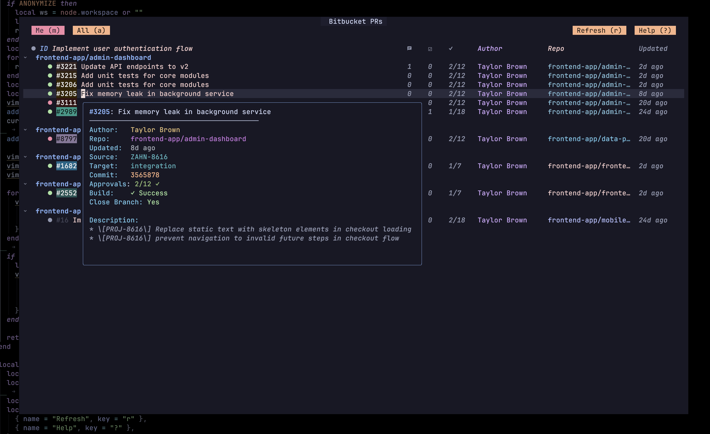
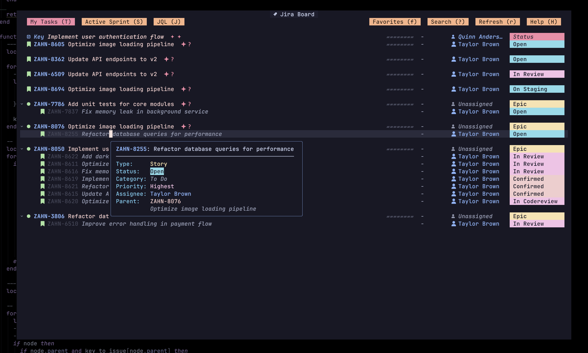

# Atlas.nvim

A Neovim plugin for managing Bitbucket PRs and Jira issues without leaving your editor.

|  |  |

> [!NOTE]
Inspired by [jira.nvim](https://github.com/letieu/jira.nvim). This plugin is adapted for my personal workflow and preferences. I highly recommend checking out the original project for a more general-purpose solution.


### Using [lazy.nvim](https://github.com/folke/lazy.nvim)

```lua
{
  "emrearmagan/atlas.nvim",
  config = function()
    require("atlas").setup({
      -- See configuration below
    })
  end,
  cmd = { "Bitbucket", "Jira" },
}
```

### Using [packer.nvim](https://github.com/wbthomason/packer.nvim)

```lua
use {
  "emrearmagan/atlas.nvim",
  config = function()
    require("atlas").setup({
      -- See configuration below
    })
  end
}
```

## Configuration

```lua
require("atlas").setup({
  -- Bitbucket
  bitbucket = {
    user = os.getenv("BITBUCKET_USER"),
    token = os.getenv("BITBUCKET_TOKEN"),
    workspace = os.getenv("BITBUCKET_WORKSPACE"),
    account_id = os.getenv("BITBUCKET_ACCOUNT_ID"),
  },
  repos = {
    { workspace = "your-workspace", repo = "repo-name" },
  },
  bitbucket_views = {
    { name = "Me", key = "m", filter = function(pr, account_id)
      return pr.author.account_id == account_id
    end },
    { name = "All", key = "a", filter = function(pr, account_id)
      return pr.author.account_id ~= account_id
    end },
  },
  
  -- Jira
  jira = {
    base = os.getenv("JIRA_BASE_URL"),
    email = os.getenv("JIRA_EMAIL"),
    token = os.getenv("JIRA_TOKEN"),
  },
  jira_views = {
    { name = "Active Sprint", key = "S", jql = 'project = "%s" AND sprint in openSprints()' },
  },
  
  -- Caching
  cache_ttl = 300, -- 5 minutes
})
```

## Environment Variables

```bash
# Bitbucket
export BITBUCKET_USER="your.email@example.com"
export BITBUCKET_TOKEN="your-app-password"
export BITBUCKET_WORKSPACE="your-workspace"
export BITBUCKET_ACCOUNT_ID="your-account-id"

# Jira
export JIRA_BASE_URL="https://your-domain.atlassian.net"
export JIRA_EMAIL="your.email@example.com"
export JIRA_TOKEN="your-api-token"
```

## Commands

### Bitbucket
- `:Bitbucket` - Open PR viewer

### Jira
- `:Jira [PROJECT_KEY]` - Open Jira board
- `:Jira info <ISSUE_KEY>` - View issue details
- `:Jira edit <ISSUE_KEY>` - Edit issue
- `:Jira create [PROJECT_KEY]` - Create new issue

## Keybindings

### Bitbucket
| Key | Action |
|-----|--------|
| `j/k` | Navigate between PRs |
| `<Tab>` | Expand/Collapse repository |
| `<CR>` | Show PR details |
| `o`, `gx` | Open PR in browser |
| `r` | Refresh |
| `q` | Close |

### Jira
| Key | Action |
|-----|--------|
| `j/k` | Navigate between issues |
| `<Tab>` | Expand/Collapse Epic |
| `<CR>`, `K` | Show issue details |
| `?` | Search issues |
| `s` | Star/Unstar issue |
| `f` | Show favorites |
| `y` | Copy issue key |
| `c` | Add comment |
| `i` | Create issue |
| `gx` | Open in browser |
| `gs` | Change status |
| `ga` | Change assignee |
| `r` | Refresh |
| `q` | Close |

## License

MIT License - see [LICENSE](LICENSE) for details.
